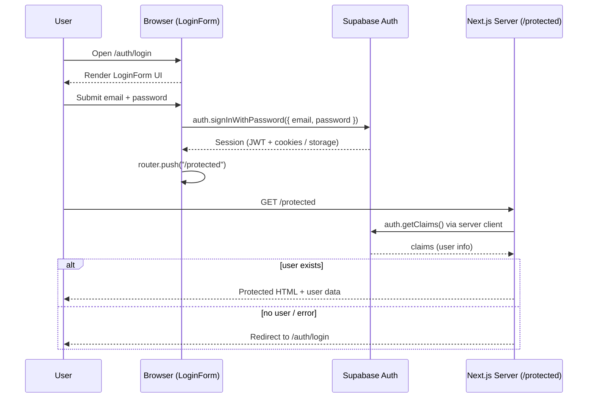
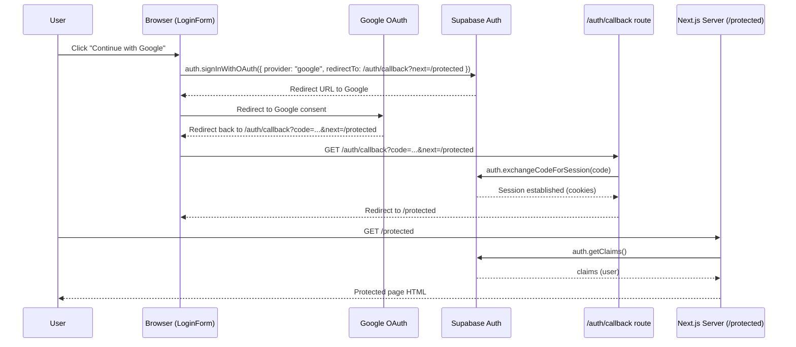
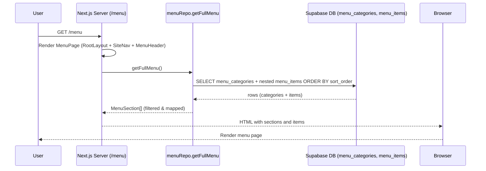

# Bite Me Web App – System Overview

## 1. High-level architecture

### Layers

- **Client (browser)**
  - Renders Next.js pages and components.
  - Runs client components like `LoginForm`, `SignUpForm`, `ForgotPasswordForm`, `LogoutButton`.
  - Uses the browser Supabase client from `lib/supabase/client.ts` for:
    - Email/password login
    - Google OAuth start
    - Sign up
    - Password reset requests

- **Next.js server (App Router)**
  - Handles routing and server components:
    - `app/layout.tsx` → global layout (ThemeProvider, `SiteNav`, `SiteFooter`).
    - `app/page.tsx` → `/` homepage (static).
    - `app/menu/page.tsx` → `/menu` menu page (SSR with Suspense and revalidation).
    - `app/protected/page.tsx` → `/protected` dashboard (auth-protected).
  - Handles route handlers (API-like endpoints):
    - `app/auth/callback/route.ts` → Supabase OAuth callback.
    - `app/auth/confirm/route.ts` → email OTP confirmation.
  - Uses the server Supabase client from `lib/supabase/server.ts` for:
    - Reading auth claims on the server
    - Fetching menu data from Postgres via Supabase
    - Exchanging OAuth codes for sessions
    - Verifying OTPs

- **Supabase (Auth + Postgres DB)**
  - **Auth**
    - Manages sessions (JWT + cookies / local storage).
    - Email/password auth, Google OAuth, OTP/links, password reset.
  - **Database**
    - Tables like `menu_categories` and `menu_items`.
    - Queried by `lib/menuRepo.ts` → `getFullMenu()`.

- **External providers**
  - Email provider used by Supabase for password reset and email confirmations.
  - Google OAuth provider for social login.

---

## 2. Route and page map

### Global layout

- **`app/layout.tsx`**
  - Wraps every page with:
    - `ThemeProvider` (dark/light themes).
    - `SiteNav` at the top.
    - `SiteFooter` at the bottom.
  - Sets `metadataBase` using `VERCEL_URL` or `http://localhost:3000`.

### Public pages

- **`/` → `app/page.tsx`**
  - Simple homepage.
  - Static content, no Supabase calls.
  - Encourages navigation to the menu.

- **`/menu` → `app/menu/page.tsx`**
  - `MenuPage`:
    - Renders `MenuHeader`.
    - Uses `<Suspense fallback={<MenuSkeleton />}>` around `MenuContent`.
  - `MenuContent` (async server component):
    - Calls `getFullMenu()` from `lib/menuRepo.ts`.
    - Renders one `MenuSectionBlock` per section.
    - On error, shows a red error card.
  - `export const revalidate = 60;`
    - Page is server-rendered and revalidated every 60 seconds (ISR-style).

- **`/contact`**
  - Listed in `components/layout/nav-items.ts` as `{ label: "Contact", href: "/contact" }`.
  - Implementation would be another public page.

### Auth pages

- **`/auth/login` → `app/auth/login/page.tsx`**
  - Renders `LoginForm` (client component).
  - `LoginForm` uses browser Supabase client to:
    - `auth.signInWithPassword` for email/password.
    - `auth.signInWithOAuth` for Google (redirects to `/auth/callback`).

- **`/auth/sign-up` → `app/auth/sign-up/page.tsx`**
  - Renders `SignUpForm` (client component).
  - `SignUpForm` uses browser Supabase client:
    - `auth.signUp({ email, password, options: { emailRedirectTo: <origin>/protected } })`.
    - On success, `router.push("/auth/sign-up-success")`.

- **`/auth/forgot-password` → `app/auth/forgot-password/page.tsx`**
  - Renders `ForgotPasswordForm` (client component).
  - `ForgotPasswordForm` uses browser Supabase client:
    - `auth.resetPasswordForEmail(email, { redirectTo: <origin>/auth/update-password })`.
    - Shows success state once email is sent.

- **`/auth/error` → `app/auth/error/page.tsx`**
  - Server component page.
  - Reads `searchParams` (`?error=...`) and displays a friendly error message.

### Auth route handlers (server)

- **`/auth/callback` → `app/auth/callback/route.ts`**
  - Handles OAuth redirect from providers (Google).
  - Flow:
    - Reads `code` and `next` from query string (`next` defaults to `/protected`).
    - Creates Supabase server client.
    - Calls `supabase.auth.exchangeCodeForSession(code)`.
      - On success → session cookie is set.
      - On error → redirect to `/auth/error?error=<message>`.
    - Redirects to `next`.

- **`/auth/confirm` → `app/auth/confirm/route.ts`**
  - Handles email OTP confirmation links.
  - Flow:
    - Reads `token_hash`, `type`, and `next` from query string.
    - Calls `supabase.auth.verifyOtp({ type, token_hash })`.
    - On success → redirect to `next` (default `/`).
    - On error → redirect to `/auth/error?error=<message>`.

### Protected area

- **`app/protected/layout.tsx`**
  - Local layout for `/protected` subtree.
  - Centers and constrains protected content.

- **`/protected` → `app/protected/page.tsx`**
  - Server component.
  - Flow:
    - Creates Supabase server client.
    - Calls `supabase.auth.getClaims()`.
    - If error or no claims → `redirect("/auth/login")`.
    - If claims present → renders a protected page and prints claim JSON.

### Navigation & chrome

- **`components/layout/nav-items.ts`**
  - Central nav config:
    - Home (`/`)
    - Menu (`/menu`)
    - Contact (`/contact`)

- **`SiteNav`**
  - Uses `navItems` to render primary nav.
  - Shows logo and branding.
  - Shows phone number.
  - Shows:
    - `AuthButton` (server component) on larger screens.
    - `HamburgerMenu` (client) for smaller screens.

- **`AuthButton`**
  - Server component.
  - Uses Supabase server client → `auth.getClaims()`.
  - If logged in:
    - Derives `email` and avatar.
    - Shows avatar, email, "Dashboard" button (`/protected`), and `LogoutButton`.
  - If logged out:
    - Shows links to `/auth/login` and `/auth/sign-up`.

- **`LogoutButton`**
  - Client component.
  - Uses browser Supabase client:
    - `auth.signOut()` then `router.push("/auth/login")`.

- **`SiteFooter`**
  - Simple static footer with location and social handle.

---

## 3. Auth and data architecture

### Supabase clients

- **Server Supabase client** → `lib/supabase/server.ts`
  - Uses `createServerClient` from `@supabase/ssr`.
  - Reads cookies via `cookies()` from `next/headers`.
  - Configured via `NEXT_PUBLIC_SUPABASE_URL` and `NEXT_PUBLIC_SUPABASE_ANON_KEY`.
  - Used by:
    - `lib/menuRepo.ts` (`getFullMenu`).
    - `AuthButton`.
    - `/protected` page.
    - `/auth/callback` route.
    - `/auth/confirm` route.

- **Browser Supabase client** → `lib/supabase/client.ts`
  - Uses `createBrowserClient` from `@supabase/ssr`.
  - Same env vars as server client.
  - Used by:
    - `LoginForm`.
    - `SignUpForm`.
    - `ForgotPasswordForm`.
    - `LogoutButton`.

- **Middleware helper** → `lib/supabase/middleware.ts`
  - Provides `updateSession(request: NextRequest)`:
    - If env vars missing, returns early.
    - Creates a `createServerClient` wired to `request.cookies`.
    - Calls `auth.getClaims()` to refresh session and keep cookies in sync.
    - If no user and path is not `/`, `/login`, or `/auth/*`, redirects to `/auth/login`.
  - To fully use this, you would add a root `middleware.ts` that delegates to `updateSession`.

### Menu data flow

- **Database**
  - `menu_categories` table with a relationship to `menu_items`.

- **Repository** → `lib/menuRepo.ts`
  - `getFullMenu()`:
    - Creates Supabase server client.
    - Queries `menu_categories` with nested `menu_items`, selecting id, name, slug, description, price fields, and `active`.
    - Orders by `sort_order` (categories and items).
    - Filters `menu_items` to `active === true`.
    - Maps DB rows into `MenuSection[]` with nested `MenuItem[]`.

- **UI**
  - `MenuPage`:
    - Uses Suspense with `MenuSkeleton`.
    - Renders `MenuSectionBlock` per section using data from `getFullMenu`.

---

## 4. Diagrams

### 4.1 Overall system context

```mermaid
flowchart TD
    U[User Browser] -->|HTTP request (/, /menu, /auth/*, /protected)| N[Next.js App (App Router)]

    subgraph N2[Next.js Server]
      L[RootLayout (SiteNav + SiteFooter + ThemeProvider)]
      P1[Pages & Server Components\n/app/page.tsx\n/app/menu/page.tsx\n/app/protected/page.tsx]
      R1[Route Handlers\n/auth/callback\n/auth/confirm]
      L --> P1
      L --> R1
    end

    N --> N2

    subgraph C1[Client Components (Browser)]
      CF1[LoginForm / SignUpForm\nForgotPasswordForm\nLogoutButton]
      CF2[HamburgerMenu]
    end

    U --> C1

    subgraph S[Supabase]
      SA[Auth (sessions, OAuth, OTP)]
      SD[Postgres DB\nmenu_categories + menu_items]
    end

    N2 -->|createServerClient| SA
    N2 -->|queries via Supabase\n(getFullMenu, getClaims)| SD
    C1 -->|createBrowserClient| SA

    SA -->|JWT + cookies| U
    SA --> SD
```

---

### 4.2 Auth – email/password + Google OAuth

#### Email/password login flow

1. User visits `/auth/login`.
2. Browser renders `LoginForm`.
3. User submits email/password.
4. Client Supabase calls `auth.signInWithPassword`.
5. Supabase issues session (JWT + cookies/local storage).
6. `router.push("/protected")`.
7. `/protected` server component:
   - Uses server Supabase client `auth.getClaims()`.
   - If user exists → render dashboard.
   - If not → redirect to `/auth/login`.



#### Google OAuth login flow

1. User clicks "Continue with Google".
2. Client Supabase calls `auth.signInWithOAuth` with `redirectTo: <origin>/auth/callback?next=/protected`.
3. Browser goes to Google, then back to `/auth/callback?code=...&next=/protected`.
4. `/auth/callback` route handler:
   - Calls `auth.exchangeCodeForSession(code)` on the server.
   - On success → session cookie set, redirect `/protected`.
   - On error → redirect `/auth/error?error=<msg>`.



---

### 4.3 Password reset and email confirmation

#### Password reset flow (high level)

1. User opens `/auth/forgot-password`.
2. `ForgotPasswordForm` calls `auth.resetPasswordForEmail(email, { redirectTo: /auth/update-password })`.
3. Supabase emails a password reset link to `/auth/update-password`.
4. User clicks the link, lands on `/auth/update-password` (page to be implemented).
5. That page uses browser Supabase client to call `auth.updateUser({ password })` and then redirects to `/protected` or `/auth/login`.

#### Email confirmation via `/auth/confirm`

1. Supabase emails user a link like `/auth/confirm?token_hash=...&type=...&next=/`.
2. User clicks link.
3. `/auth/confirm` route handler:
   - Reads `token_hash`, `type`, and `next`.
   - Calls `auth.verifyOtp({ type, token_hash })`.
   - On success → redirect to `next`.
   - On error → redirect to `/auth/error?error=<msg>`.

_Note_: Current `SignUpForm` uses `emailRedirectTo: <origin>/protected`, which you can later adjust to integrate with `/auth/confirm` if you prefer OTP links.

---

### 4.4 Menu data flow

1. User requests `/menu`.
2. Next.js server runs `MenuPage`:
   - Uses `RootLayout` (nav + footer).
   - Renders `MenuHeader`.
   - Wraps `MenuContent` in `<Suspense>` with `MenuSkeleton` fallback.
3. `MenuContent` calls `getFullMenu()`.
4. `getFullMenu()`:
   - Creates server Supabase client.
   - Queries `menu_categories` and nested `menu_items` ordered by `sort_order`.
   - Filters out inactive `menu_items`.
   - Maps rows to typed `MenuSection[]` with nested items.
5. `MenuContent` renders `MenuSectionBlock` per section.
6. HTML is sent to browser and rendered.



---

## 5. Summary

- The app is a Next.js App Router project backed by Supabase Auth + Postgres.
- Public pages: `/`, `/menu`, `/contact`.
- Auth pages: `/auth/login`, `/auth/sign-up`, `/auth/forgot-password`, `/auth/error`, `/auth/callback`, `/auth/confirm` (plus expected `/auth/sign-up-success` and `/auth/update-password`).
- Protected area: `/protected`, which validates the user via server-side `auth.getClaims()`.
- Auth flows use:
  - Client Supabase for sign-in, sign-up, OAuth, and password reset requests.
  - Server Supabase for claims checks, menu fetch, and handling callbacks.
- Menu data is fetched via a repository (`lib/menuRepo.ts`) using Supabase, rendered on `/menu` with Suspense and a skeleton loader, revalidated every 60 seconds.
